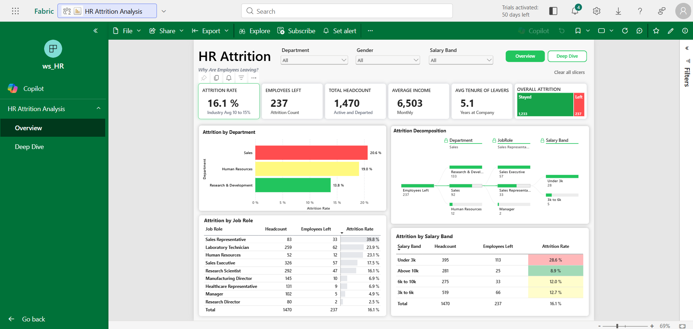
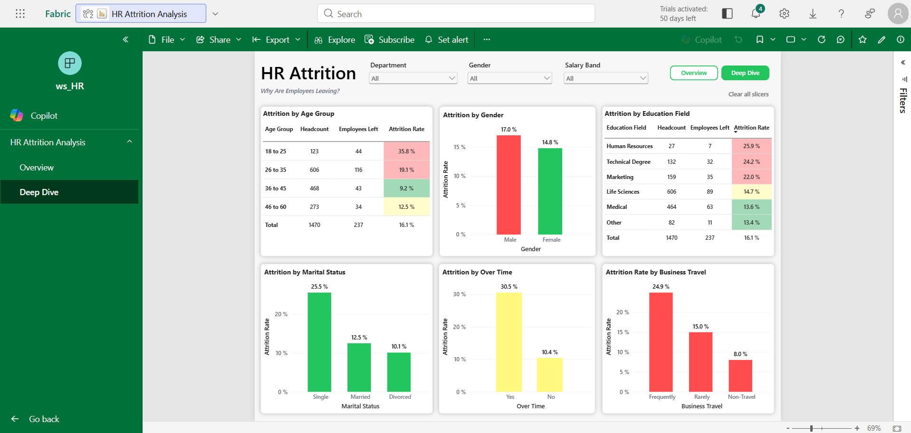

# HR Attrition Analysis (Microsoft Fabric)

An interactive HR attrition dashboard built on **Microsoft Fabric**, analyzing 1,470 employee records to uncover why employees leave with **Row-Level Security** enforced at the data layer so each Region Manager only sees their own team's data.

---

## Dashboard Preview




---

## Project Objective

To move beyond a single "16% attrition rate" headline number and build a governed, secure BI solution that answers:
- **Which** departments, job roles, and salary bands have the highest attrition?
- **Who** is leaving — by age, gender, marital status, education, and work patterns (overtime, travel)?
- **How** can sensitive HR data be shared safely across a report, so each manager sees only what they're authorized to see?

---

## Architecture Overview

```
┌──────────────┐    ┌──────────────────┐   ┌──────────────────┐    ┌──────────────────┐
│  IBM HR CSV  │──▶│ Fabric Lakehouse │──▶│  Semantic Model  │──▶│  Power BI Report │
│ (1,470 rows) │    │  (lh_HR)         │   │  (HR semantic)   │    │  (2 pages, live) │
└──────────────┘    └──────────────────┘   └──────────────────┘    └──────────────────┘
                              │
                              ▼
                    ┌──────────────────────┐
                    │  Row/Column-Level    │
                    │  Security (RLS/CLS)  │
                    │  via DefaultReader   │
                    └──────────────────────┘
```

Unlike a typical imported Power BI file, this report holds a **live connection** to a Fabric semantic model built directly on top of the Lakehouse table — meaning the report always reflects the current state of the underlying data, and security rules are enforced centrally rather than duplicated in the report itself.

---

## Fabric Workspace Structure

| Item | Type | Purpose |
|---|---|---|
| `lh_HR` | Lakehouse | Stores the `hr_employees` table (1,470 rows, 37 columns) loaded from the source CSV |
| `dataflow_HR` | Dataflow Gen2 | Handles data preparation/loading into the Lakehouse |
| `HR semantic` | Semantic Model | Live semantic layer on top of the Lakehouse table; hosts Row-Level Security and Column-Level Security rules |
| `HR Attrition Analysis` | Power BI Report | Final 2-page interactive report, connected live to the semantic model |

---

## Security Implementation

A `DefaultReader` role was configured directly on the Lakehouse table with:
- **Read** permission, **Grant** type access
- **Column-Level Security (CLS)** constraints applied to the `hr_employees` table, restricting visibility of sensitive columns (e.g. compensation-related fields) for members assigned to this role

This means security is enforced **once, at the data source**, and automatically applies to anyone accessing the report or semantic model through that role — rather than needing to rebuild filters or hide visuals separately in every report.

---

## Report Structure

| Page | Focus | Key visuals |
|---|---|---|
| **Overview** | High-level attrition KPIs and department/role/salary breakdowns | 6 KPI cards, attrition-by-department bar chart, attrition decomposition tree, attrition-by-job-role table, attrition-by-salary-band table |
| **Deep Dive** | Demographic and behavioral attrition drivers | Attrition by age group, gender, education field, marital status, overtime, and business travel frequency |

Both pages share a common filter bar (**Department**, **Gender**, **Salary Band**) that cross-filters every visual simultaneously.

---

## Dataset

**Source:** [IBM HR Analytics Employee Attrition & Performance](https://www.kaggle.com/datasets/pavansubhasht/ibm-hr-analytics-attrition-dataset) — a widely-used, industry-recognized synthetic HR dataset

| Detail | Info |
|---|---|
| Rows | 1,470 employees |
| Columns | 35 (source) → 37 in Lakehouse (with added surrogate columns) |
| Key fields | Age, Attrition, Department, JobRole, MonthlyIncome, OverTime, JobSatisfaction, WorkLifeBalance, YearsAtCompany, EducationField, MaritalStatus, BusinessTravel |
| Tool used | Microsoft Fabric (Lakehouse, Dataflow, Semantic Model), Power BI |

---

## Key Findings

1. **Overall attrition rate is 16.1%** (237 of 1,470 employees), sitting just above the stated industry benchmark of 10–15%.
2. **Sales has the highest departmental attrition at 20.6%**, followed by Human Resources (19.0%); Research & Development is comparatively stable at 13.8%.
3. **Sales Representatives are the single highest-risk role**, with a striking **39.8% attrition rate** — more than double the next-highest role (Laboratory Technician at 23.9%).
4. **Compensation is a major driver** — employees in the "Under 3k" salary band churn at **28.6%**, versus just **8.9%** for those earning above 10k, showing a clear inverse relationship between pay and retention.
5. **Overtime is strongly linked to attrition** — employees working overtime leave at **30.5%**, nearly 3x the rate of those who don't (10.4%).
6. **Younger and single employees are highest-risk demographically** — the 18–25 age group churns at **35.8%**, and single employees leave at **25.5%**, both well above their respective peer groups.
7. **Frequent business travel correlates with higher attrition (24.9%)** compared to rare (15.0%) or no travel (8.0%), suggesting travel burden is a meaningful retention factor.

---

## Skills Demonstrated

| Category | Skill |
|---|---|
| Data ingestion | Loading a CSV dataset into a Fabric Lakehouse via Dataflow Gen2 |
| Data governance & security | Configuring Row-Level Security (RLS) and Column-Level Security (CLS) directly on Lakehouse tables via workspace roles |
| Semantic modeling | Building a live Power BI semantic model on top of Lakehouse data rather than an imported static copy |
| Live/thin reports | Building a Power BI report with a live connection to a semantic model (no local data model duplication) |
| Data visualization | KPI cards, decomposition tree, cross-filtered slicers, ranked tables with conditional formatting, multi-page report navigation |
| HR analytics | Attrition-rate calculation across multiple dimensions (department, role, salary band, age, gender, education, marital status, overtime, travel) |

---

## How to Reproduce This Project

1. Create a Microsoft Fabric workspace (free trial available via Power BI / Fabric)
2. Create a Lakehouse named `lh_HR`
3. Load `HR-Employee-Attrition.csv` into the Lakehouse using a Dataflow Gen2, creating the `hr_employees` table
4. Configure a `DefaultReader` role on the Lakehouse with Read access and appropriate Column-Level Security constraints on sensitive fields
5. Create a semantic model (`HR semantic`) on top of `hr_employees`
6. Open `HR_Attrition_Analysis.pbix` in Power BI Desktop, or build a new live-connected report against the `HR semantic` model
7. Publish and assign users to the `DefaultReader` role to test security enforcement

---

## What I Learned

- How to implement Row-Level and Column-Level Security directly at the Lakehouse layer in Fabric, so access control is enforced once at the data source rather than duplicated across multiple reports.
- The difference between a standard imported Power BI report and a "thin" report with a live connection to a shared semantic model — and why the live approach keeps the report perpetually in sync with the underlying data.
- How to translate a single attrition-rate metric into a genuinely actionable HR narrative by decomposing it across department, role, compensation band, and demographic dimensions simultaneously.
- How compounding risk factors (e.g. young + single + frequent overtime + low salary band) can be identified by cross-referencing multiple breakdown views rather than relying on any one chart alone.

---

## About

Built by **Atharv Dhole** as part of a data analyst portfolio project.

- LinkedIn: https://linkedin.com/in/atharv-dhole
- Email: atharvdhole22@email.com

---
